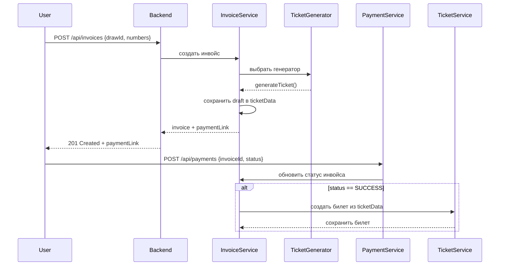

swagger - http://localhost:8080/swagger-ui.html

# MiFiLottery
Проектная практика МИФИ, магистратура

## 1. Общие требования

**Цель:**

Создание системы для проведения лотерейных тиражей с возможностью покупки билетов, определения выигрышей и интеграции с платежными системами.

**Язык программирования** 

* Java 17+. 

**Фрейворк**

* Spring Boot 3.x

**База данных** 

* PostgreSQL 17

**Архитектура** 

* Монолит с четким разделением слоев: Controller → Service → Repository.

**Безопастность**

* Аутентификация через JWT-токены

**Роли пользователей**
  
* USER - покупка билетов, проверка результатов, история своих покупок и результатов тиражей
* ADMIN - управление тиражами, играми, отмена тиражей. Дополнительно должен иметь доступ к статистике и отчётам по всем пользователям.


## 2. Основные компоненты системы

### 2.0. Сущность User ###

**Основные поля**

* id
* role
* telegram
* balance

**Опционально**

* username
* password
* created_at
* is_active
* referal_link

*Примечание: Логин и пароль для аутентификации и выдачи токена лучше, наверное, сделать. Roles можно вынести в отдельную таблицу*

### 2.1. Тиражная служба (Draw Service) ###

Описание: Тиражная служба управляет лотерейными тиражами, их статусами и расписанием. Она отвечает за создание, изменение и отмену тиражей, а также за автоматическое определение результатов.

**Сущности:**

**Draw (Тираж):** 
* id (уникальный идентификатор).
* name (имя или сквозной номер тиража).
* lottery_type_id (тип лотереи, например, "5 из 36").
* start_time (дата и время начала тиража).
* duration (длитеь ность тиража в статусe Active).
* status (статус):
  - PLANNED - тираж создан, но ещё не начался, можно покупать билеты,
  - ACTIVE - тираж активен, можно покупать билеты,
  - COMPLETED - тираж завершен, результаты определены,
  - CANCELLED - тираж отменен.

**DrawResult (Результат тиража):**
* id.
* draw_id (ссылка на тираж).
* winning_combination (выигрышная комбинация чисел или ).
* result_time (время определения результатов).

*Примечание: может сюда положить призового фонда, ведь она фиксируется по результату тиража по сумме проданных билетов, а также добавить JSON поле с массивом/словарем выигравших билетов*

* prize_pool (сумма призового фонда = сумма ьилетов тиража * prize_pool_percentage)
* winning_tickets (например: {"winnners": [{id1:[combination1, prize_amount]}, {id2:[combination2, prize_amount]} ]}, ...])

**LotteryType (Тип лотереи):**
* id.
* description (или name - описание/имя типа лотерии, например, "5 из 36").
* ticket_price (стоимость билета для этого типа лотерии).
* min_ticket(минимальное кол-во билетов для тиража, иначе он не состоится).
* prize_pool_percentage (% от суммы проданных всех билетов, который формирует сумму призового фонда)

*API:*
* POST /api/admin/draws (только ADMIN): Создание тиража с указанием типа лотереи и времени старта.
* GET /api/draws/active: Получение списка активных тиражей.
* GET /api/draws/available: тиражи, в которых можно купить билеты - выборка по статусам ACTIVE + PLANNED).
* PUT /api/admin/draws/{id}/cancel (только ADMIN): Отмена тиража (изменение статуса на CANCELLED).
* GET /api/draws/{id} - детальная информация о тираже.
* GET /api/draws/{id}/results - результаты тиража.

*Логика:*
* Автоматический переход статусов:
* При наступлении startTime статус меняется с PLANNED на ACTIVE.
* По завершении времени тиража статус меняется на COMPLETED, запускается алгоритм определения выигрышей.
* При отмене тиража все связанные билеты помечаются как недействительные.
* Отмена должна быть возможна как для PLANNED, так и для ACTIVE тиражей. Для COMPLETED тиражей отмена недопустима.
* Добавьте возможность просматривать историю завершенных тиражей
* API для получения информации о предыдущих тиражах и их результатах.

### 2.2. Служба генерации билетов (Ticket Service) ###

Описание: Служба генерации билетов отвечает за создание билетов для участия в тиражах. Поддержка двух режимов генерации:
* Предсозданные билеты: Система генерирует билеты автоматически **«на лету»** (для лотерей, где выбор чисел запрещен).
* Пользовательский выбор: Пользователь самостоятельно выбирает числа (например, для лотереи "5 из 36").

**Сущности:**

**Ticket (Билет):**
* id.
* user_id (идентификатор пользователя).
* draw_id (идентификатор тиража).
* Data описание данных билета в JSON: например {"numbers":[1, 5, 10, 15, 20]}
* status (статус: PENDING, WIN, LOSE, CENCELLED). *Примечание: PENDING переименовать в INGAME*

*API:*
* GET /api/tickets/{id} (только USER): Получение информации о билете (числа, статус, тираж).

*Логика:*
* Гененрировать билеты только "на лету" по запросу:
  - не хранить непроданые билеты в БД
  - по запросу генерировать новый случайный билет в соответствии с типом лотерии
  - после оплаты сохранять билет в БД с привязкой к пользователю
  - до оплаты билет имеет только временную привязку в InvoiceData

*Логика автоматической лотереи: генерируем id билета при продаже, а при определении результата выбираем из сгенерированных id случайным образом - только 1 победитель*

* Валидация чисел:
  - Для лотереи "5 из 36": 5 уникальных чисел в диапазоне 1–36.
  - При невалидных данных возвращается ошибка 400 Bad Request.
  - При создании билета проверяется, что тираж в статусе PLANNED или ACTIVE.
* Добавьте возможность пользователям просматривать историю своих билетов и их статусы.
* GET /api/tickets API для получения списка всех билетов пользователя с учетом тиражной информации.

### 2.3. Шлюз оплаты (Payment Service) ###

Описание: Шлюз оплаты отвечает за обработку платежей за покупку билетов с интеграцией с mock-платежной системой.

*Для MVP: 1 invoice = 1 ticket*
*По сути, инфойс - корзина для временного билета*
*Инвойс нельзя удалить - только отменить*

**Сущности:**

**Invoice (инвойс):**
* id.
* user_id - пользователь, создавший инвойс,
* ticket_data данные по билету(JSON из сущности tiket) - для будущего масштабирования нужно сделать массив, чтобы в последствии класть в 1 инвойс несколько билетов.
* register_time – время регистрации.
* payment_link - сгенерированная бэкэндом (платёжным шлюзом) ссылка на оплату
* status:
  - UNPAID - инвойс создан, но не оплачен - по умолчанию
  - PENDING – ожидает оплаты, в этом статусе нельзя отменить
  - PAID - инвойс оплачен
  - REFUNDED - средства возвращены
* cancelled. 0/1 - инвойс отменен, не может быт ьоплачен. Если был оплачен - нужно/можно сделать refund - по-умолчанию - 0.

**Payment (Платеж):**
* id.
* invoice_id - вторичный ключ-ссылка на инвойс
* amount (сумма платежа).
* status (SUCCESS, FAILED).
* payment_time (время выполнения платежа).

*API:*
* POST /api/invoice - зарегестрировать invoice. Параметры: Invoice – инвойс к регистрации, Осуществляет регистрацию инвойса
* POST /api/payments - зарегестрировать платёж (только USER). Параметры: cardNumber (номер карты), cvc (CVC-код). Симулирует успешную (80%) или неудачную (20%) оплату. *Mock-сервис на этом же сервере - принимает запрос на оплату отдаёт результат success/failed*

*Логика:*
* При оплате инвойса делаем проверку в каком статусе тираж (по данным в билете) - если Active - все ок, иначе оплатить нельзя.
* Запрос на оплату (POST /api/payments) "блокирует" инвойс - переводит в статусс PENDING
* Если инвойс в статусе PENDING – его нельзя отменить. Если оплата прошла – он переходит в статус PAID, если оплата не удалась – возвращается в статус UNPAID
* По окончании тиража все неоплаченные инвойсы становятся cancelled.
* Для тестовой среды - для MVP делаем валидацию запроса только по CVC:
  - Любой номер карты принимается, **если CVC = 123**.
  - При успешной оплате билет привязывается к пользователю.
  - При неудаче билет не создается Инвойс возвращается в исходное состояние.

### 2.4. Служба определения результатов (Draw Result Service) ###

Описание: Служба определения результатов отвечает за генерацию выигрышных комбинаций и обновление статусов билетов.

**Логика:**

* После завершения тиража (status = COMPLETED):
* Генерация выигрышной комбинации с использованием SecureRandom.
* Сравнение чисел билетов с выигрышной комбинацией – для билетов типа «5 из 36».
* Определение победителей по правилам лотереи и расчет сумм выигрышей:
  - Для предсозданных билетов: один победитель (полн. совпадение или рандом)
  - Для лотерей с выбором чисел: если в категории несколько победителей, призовой фонд категории делится поровну, или в % соотношении по кол-ву совпавших в билете чисел.
  - Результаты расчета пишем в DrawResults в winning_tickets
*  Обновление статусов билетов (WIN/LOSE).
*  Добавьте возможность пользователям просматривать историю своих билетов и их статусы.

Алгоритмы для разных типов лотерей:

* Лотереи с предсозданными билетами: Проверка полного совпадения чисел.
* Лотереи с выбором пользователя: Проверка частичного совпадения (например, 3 из 5 чисел).

*API:*
* GET /api/draws/{id}/results: Получение выигрышной комбинации тиража.
* GET /api/tickets/{id}/check-result (только USER): Проверка результата билета.
* GET /api/draws/{id}/winners - получение списка победителей тиража.

### 2.5. Служба выгрузки данных (Export Service) ###

Описание:
Формирование отчетов по завершенным тиражам и начисление выигрышей.

**Логика:**
Большинство данных уже будут к этому моменту в DrawResults в winning_tickets
После определения результатов тиража:
* Начисление выигрышей на счета пользователей – внутренний баланс модели USER.
* Выгрузка данных о выигрышных билетах в формате CSV/JSON.
* Отчет должен содержать:
  - Идентификатор тиража.
  - Выигрышную комбинацию.
  - Список выигравших билетов с суммами.
* Добавьте возможность выгрузки статистики по пользователям, выигрышам и тиражам в виде отчетов (например, по месяцам) в формате csv/json

## 3. Нефункциональные требования ##

**Производительность (тестируем через Постман):**
* Время ответа API не более 0.5 секунды.
* Поддержка до 1000 запросов в секунду
  
**Безопасность:**
* Данные платежей (карты) не хранятся в системе.
* JWT-токены с сроком действия 1 час.

**Логирование:**
* Уровни логирования:
  - INFO: Регистрация создания тиражей, успешных платежей.
  - WARN: Попытки доступа к запрещенным ресурсам – ошибки авторизации.
  - ERROR: Сбои при оплате, ошибки генерации результатов.
* Формат логов:
  - JSON-логи для интеграции с системами мониторинга (ELK, Grafana Loki).
  - Обязательные поля: timestamp, service, level, message, user_id (если есть).
* Ротация логов:
  - Настройка ежедневной ротации лог-файлов с архивированием (например, через Logback).

**Масштабируемость:**
* Использование интерфейсов для алгоритмов определения результатов
* Стратегия для разных правил розыгрыша
* Абстрактная фабрика для создания билетов разных типов
* Подготовка к возможному разделению на микросервисы в будущем

## 4. Интерфейсы ##

**REST API:**
* Формат запросов/ответов: JSON.
  
**База данных:**
* Схема должна быть нормализована (2NF).
* Индексы для ускорения поиска по drawId, userId, status.

## 5. Уведомления ##

**Интеграция с мессенджерами или с почтой:**
* Отправка результатов тиражей через Telegram Bot API.
* Email-уведомления: Шаблоны писем для победителей (например, через SendGrid).
* Уведомления администраторов о критических ошибках.

## 6. Тестирование ##

* Интеграционные тесты: коллекция для postman.
  
**Сценарии:**

* Покупка билета с успешной/неудачной оплатой.
* Отмена тиража с проверкой статусов билетов.
* Генерация выигрышной комбинации для разных типов лотерей.
* Вывод всех билетов пользователя

## 7. Дополнительные требования ##

**Деплой:**

* Развертывание в Docker-контейнере.
* Настройка подключения к PostgreSQL через переменные окружения.

**Документация:**

* README с инструкцией по запуску и примеры запросов.

*Примечание: Архитектура должна обеспечивать модульность и легкость поддержки.*

## 8. Дополнительные функции ##

**История операций:**

* Эндпоинт /api/users/me/history для просмотра покупок и выигрышей.

**Возврат средств:**

* API для отмены билета (если тираж отменен).
 
**Реферальная система:**

* Бонусы за приглашение друзей (опционально).

## 9. Алгоритм работы сервиса тиражей ##

**Основная идея**

Сервис тиражей работает на очередях отложенных задач, которые ниже будут называться планировщиками. Основаны они на ScheduledExecutorService.
Один планировщик (executorPlanned) предназначен для запланированных тиражей, статус которых PLANNED. Второй (executorActive) - для активных тиражей, 
статус которых ACTIVE. Если тираж запланирован на какое-то время, то создаётся задача с отложенным временем запуска 
T = startTime - currentTime и передаётся в executorPlanned. Когда эта задача запускается, то она меняет статус тиража из PLANNED на ACTIVE и 
создаёт задачу для executorActive с отложенным запуском T=(startTime+duration)-currentTime.
Когда задача из executorActive запускается, то она меняет статус тиража из ACTIVE на COMPLETED.
Все планировщики содержат в себе тиражи только на текущие сутки, во избежания перегрузки лишними потоками системы.
В начале каждых суток запускается отдельная задача (с помощью  @Scheduled(cron = "0 0 0 * * ?")), которая пробегает по всем тиражам 
и заносит нужные тиражи в соответствующие планировщики.

Работа сервиса тиражей делится на три основные фазы:
* проверка тиражей при запуске
* обработка запроса создания тиража
* актуализация тиражей в начале новых суток

**Проверка тиражей при запуске**
1. При запуске из таблицы Draw вычитываются все тиражи со статусом ACTIVE с датой соответствующей текущей дате и ранее. Список отсортирован от самых старых дат до самых свежих.
2. Если (startTime + duration) <= текущего времени, то тираж помечается как COMPLETED.
3. Если (startTime + duration) > текущего времени, то тираж помещается в executorActive.
4. Далее вычитываются все тиражи со статусом PLANNED с датой соответствующей текущей дате и ранее. Список отсортирован от самых старых дат до самых свежих.
5. Если (startTime + duration) <= текущего времени, тираж просрочен и помечается как CANCELLED.
6. Если (startTime) <= текущего времени, тираж помечается как ACTIVE и отправляется в executorActive.
7. Если (startTime) > текущего времени, тираж отправляется в executorPlanned.
8. Конец.

**Обработка запроса на создание тиража**
1. Если дата запроса тиража в будущем, но не в текущие сутки, то просто помещаем регистрируем тираж в БД как PLANNED.
2. Если тираж в текущие сутки, и сейчас нету подобного тиража с таким же типом лотереи в статусе ACTIVE или PLANNED, то он помещается в executorPlanned и регистрируется в БД.
3. Если тираж с таким же типом лотерии в статусе ACTIVE или PLANNED, то не регистрируем такой тираж и возвращаем ошибку.
4. Конец.

**Актуализация тиражей в начале новых суток**
1. В начале новых суток запускается задача, которая осуществляет проверку, описанную выше в "Проверка тиражей при запуске".
2. Конец


## **Алгоритм модуля работы с билетами, инвойсам, оплатой**

## **Основная идея**
Сервис реализует продажу лотерейных билетов через **инвойс-ориентированный подход**:
- Билет создаётся **только после успешной оплаты**.
- До этого — билет существует **в виде черновика внутри инвойса**.
- Инвойс содержит все данные для генерации билета: тираж, числа (если пользователь их указывал), статус оплаты и ссылка на оплату.
- Сервис генерации билетов использует паттерн **Стратегия** через `TicketsFactory`, чтобы создавать билеты разных типов в зависимости от правил лотереи.
- Генерация билетов происходит **"на лету"** (по запросу) либо из **предсозданного пула** (для `FixedPool`-лотерей). После генерации билет временно резервируется через инвойс ("корзину"). После успешной оплаты инвойса сохраняется в БД.

---

## **1. Основные сущности**

| Сущность | Назначение |
|---------|------------|
| **Ticket** | Сохранённый билет в БД после оплаты |
| **Invoice** | Временный контейнер для черновика билета до оплаты |
| **Draw** | Тираж лотереи, содержит правила генерации билетов |
| **TicketGenerator** | Интерфейс для реализации разных стратегий создания билетов |
| **TicketsFactory** | Фабрика, выбирающая нужный `TicketGenerator` по правилам тиража |

---

## **2. Критический путь: покупка билета**

### **2.1. Создание инвойса**
#### **Эндпойнт**: `/api/invoices`
```http
POST /api/invoices
Authorization: Bearer <token>
Content-Type: application/json

{
  "drawId": 123,
  "numbers": [5, 10, 15, 20, 45] // необязательно
}
```

#### **Как это работает**:
1. Пользователь отправляет запрос на создание инвойса с указанием `drawId`.
2. Сервис получает тираж (`Draw`) и проверяет его статус (должен быть активным).
3. Через `TicketsFactory` выбирается подходящий генератор (`TicketGenerator`) по типу лотереи:
  - `RandomUniqueTicketGenerator`
  - `FixedPoolTicketGenerator`
  - `UserSelectedTicketGenerator`
4. Генерируется **черновик билета (draft)**:
  - Если указаны `numbers` → проверяются на валидность (кол-во, диапазон, уникальность)
  - Иначе → числа генерируются автоматически
5. Данные билета сохраняются в поле `ticketData` инвойса в формате JSON:
   ```json
   {
     "drawId": 123,
     "numbers": [5, 10, 15, 20, 45]
   }
   ```
6. Инвойс сохраняется в БД со статусом `UNPAID`.

---

## **2.2. Получение ссылки на оплату**

### **Важно**
> Эта реализация пока **не используется напрямую в контроллерах**, но она полностью готова к интеграции с реальным платёжным сервисом.  


### **Цель**
Создать **защищённую ссылку на оплату**, которая:
- Содержит данные инвойса (в том числе черновик билета)
- Защищена **цифровой подписью (HMAC-SHA256)**
- Может быть использована внешней платежной системой
- Позволяет вернуться к сервису с подтверждением оплаты

---

### **Как работает**

#### **1. Инвойс создаётся и сохраняется**
После создания инвойса (`Invoice`) в него записывается:
- `ticketData` — JSON-представление черновика билета (`TicketCreateDto`)
- `userId` — пользователь, создавший инвойс
- `status = UNPAID`

#### **2. Генерируется защищённая ссылка**
Метод: `PaymentLinkGenerator.generatePaymentLink(TicketInInvoiceDto ticketInInvoice)`

##### **Что происходит внутри:**
1. Объект `TicketInInvoiceDto` сериализуется в JSON:
   ```json
   {
     "userId": 1,
     "drawId": 123,
     "numbers": [5, 10, 15, 20, 45],
     "registerTime": "2025-04-05T12:00:00",
     "ticketPrice": 100.0
   }
   ```

2. JSON кодируется в Base64 URL-safe:
   ```java
   String encodedData = Base64.getUrlEncoder().encodeToString(jsonData.getBytes(StandardCharsets.UTF_8));
   ```

3. Вычисляется подпись методом **HMAC-SHA256** от JSON-строки:
   ```java
   String signature = hmacSHA256(jsonData, SECRET_KEY);
   ```

4. Формируется финальная ссылка:
   ```
   https://mock-payment.com/pay?data=<encodedData>&signature=<signature>
   ```

---

### **2.3. Пример ссылки**
```http
https://mock-payment.com/pay?
  data=eyJ1c2VySWQiOjEsImRyYXdJZCI6MTIzLCJub3VtYmVycyI6WzUsIDEwLCAxNSwgMjAsIDQ1XSwicmVnaXN0ZXJUaW1lIjoiMjAyNS0wNC0wNVQxMjowMDowMCIsInRpY2tldFByaWNlIjoxMDB9
& signature=a1b2c3d4e5f67890...
```

---

### **2.4. Как проверяется при возврате**

Когда пользователь завершает оплату и система получает callback от платёжного сервиса:
1. Извлекается `data` и `signature` из параметров запроса.
2. Данные из `data` декодируются из Base64.
3. Пересчитывается HMAC-SHA256 от декодированных данных.
4. Сравнивается с переданной подписью.
  - Если совпадают → данные корректны и не изменялись.
  - Если нет → выбрасывается ошибка.

---

### **2.5. Безопасность данных**
| Участник | Что знает |
|---------|-----------|
| **Пользователь** | Получает ссылку, переходит по ней, но не видит содержимого |
| **Бэкенд** | Знает секретный ключ, может генерировать и проверять подписи |
| **Платёжная система** | Видит только `data` и `signature`, не знает структуры |

---

### **2.6. Зачем это сделано так**

Этот механизм позволяет:
- **Изолировать логику оплаты** от основного сервиса.
- **Гарантировать целостность данных**: нельзя подменить `drawId` или цену в запросе.
- **Расширять архитектуру** в будущем:
  - Можно добавить другие типы данных в `TicketInInvoiceDto`
  - Поддерживать разные платёжные системы
  - Легко менять алгоритм подписи

---

### **2.3. Обработка оплаты**
#### **Эндпойнт**: `/api/payments`
```http
POST /api/payments
Authorization: Bearer <token>
Content-Type: application/json

{
  "invoiceId": 789,
  "cardNumber": "123456789",
  "cvc": "123"
}
```

#### **Как это работает**:
1. Сервис получает уведомление о результате оплаты.
2. Если статус `SUCCESS`:
  - Инвойс переводится в статус `PAID`.
  - Из `ticketData` извлекаются данные черновика.
  - На основе этих данных создаётся полноценный билет (`Ticket`) и сохраняется в БД.
3. Если статус `FAILED`:
  - Инвойс остаётся в статусе `UNPAID`.
  - Билет **не создаётся**.

---

## **3. Работа с билетами**
### **Пользователь может**:
- Посмотреть **свои билеты**:
  ```http
  GET /api/tickets
  Authorization: Bearer <token>
  ```

- Посмотреть **билет по ID** (только свой):
  ```http
  GET /api/tickets/{id}
  Authorization: Bearer <token>
  ```

### **Админ может**:
- Посмотреть **все билеты**:
  ```http
  GET /api/tickets
  Authorization: Bearer <admin_token>
  ```

---

## **4. Поддерживаемые типы лотерей**

### **A. RandomUnique**
- Числа генерируются случайно.
- Пример: "5 из 36".
- Используется `RandomUniqueTicketGenerator`.

### **B. FixedPool**
- Билеты создаются заранее в пуле.
- При активации тиража вызывается `initPoolForDraw()`.
- При запросе берётся первый доступный билет из пула.
- Если пул пуст — создаётся новый билет.

### **C. UserSelected**
- Пользователь сам выбирает числа.
- Пример: "6 из 45".
- Перед созданием проверяются:
  - Количество чисел
  - Диапазон
  - Уникальность

---

## **5. Архитектурные особенности**

### **Паттерны**
- **Стратегия (`TicketGenerator`)**  
  Поддержка разных типов лотерей через интерфейс `TicketGenerator`. Позволяет гибко расширять систему новыми стратегиями.
- **Фабрика (`TicketsFactory`)**  
  Централизованное создание нужного `TicketGenerator` в зависимости от правил тиража (`AlgorithmRules`).
- **DTO / Mapper**  
  Чёткое разделение слоёв: данные передаются через DTO, маппинг между ними и сущностями осуществляется через MapStruct.
- **JSON-поле (`ticketData`)**  
  Используется для временного хранения черновика билета внутри инвойса до оплаты. Это позволяет не сохранять билет в БД, пока он не оплачен.

---

### **Безопасность**
- **JWT (JSON Web Token)**  
  Используется для аутентификации и авторизации пользователей. Все защищённые эндпоинты требуют токен с соответствующими правами.
- **Spring Security**  
  Гибкая система ограничений по ролям: разграничение доступа между `USER`, `ADMIN` и анонимными пользователями.
- **Валидация**  
  Валидация данных происходит:
  - На уровне DTO — с использованием аннотаций JSR 380
  - На уровне бизнес-логики — проверка диапазона чисел, количества, уникальности, статуса тиража и т. д.
- **Механизм защищённой ссылки на оплату**
  - Реализован способ создания безопасной подписываемой ссылки, включающий шифрование данных билета и подпись через **HMAC-SHA256** — обеспечивает защиту целостности данных при взаимодействии с внешней платёжной системой.

---

## **6. Особые случаи**

| Ситуация | Что происходит |
|---------|----------------|
| **Нехватка билетов в пуле** | Для `FixedPool` — генерируется новый билет динамически |
| **Отмена тиража** | Все связанные инвойсы отменяются, билеты не создаются |
| **Ошибка валидации чисел** | Возвращается 400 BadRequest |
| **Оплата не прошла** | Инвойс остается в статусе `UNPAID`, билет не сохраняется |
| **Инвойс уже оплачен** | Нельзя повторно обработать оплату |

---

## **7. Диаграмма последовательности**



---

## **Итог**
- Сервис гибко поддерживает разные типы лотерей через стратегии.
- Билеты создаются **только после оплаты**.
- Инвойс служит временным контейнером для черновика билета.
- Реализована **защищённая ссылка на оплату**, но пока не используется.
- Просто добавлять новые типы лотерей — достаточно реализовать `TicketGenerator`.

